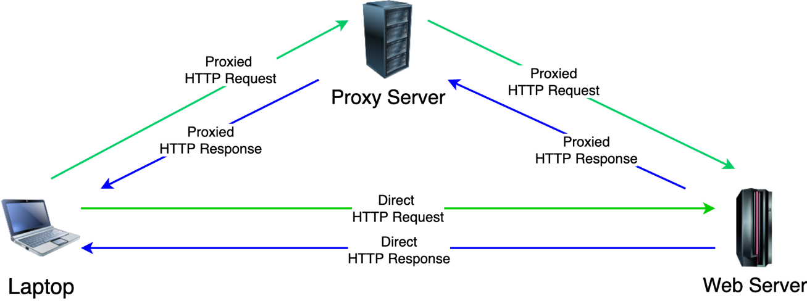
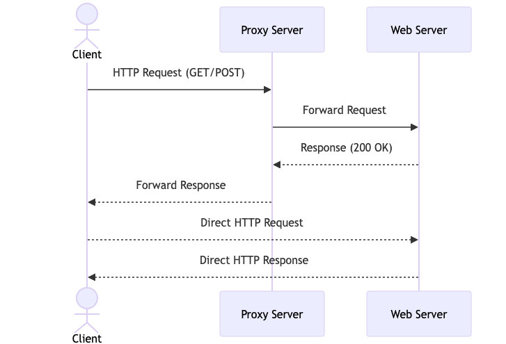

# Transparent Proxy





In basic terms, a proxy relays HTTP requests and responses back and forth between a client and a web server – see Figure 1. A transparent proxy, on the other hand, does the same thing without any configuration on the client’s part.
Figure 1: HTTP Proxy Basic Principle
This is achieved by modifying DNS records via a DNS server. For example, for the domain “www.google.com”, the DNS server should return its A record “172.217.17.100”. By using a specially-configured DNS server, the IP address can be modified to point to the IP of the transparent proxy. If this modification is done globally, then for every requested domain, the same IP of the transparent proxy can be set to be returned.

## Overview

Transparent Proxy is a Java-based application that acts as an HTTP/HTTPS proxy server, providing features like content filtering, caching, and logging. Built with JavaFX for the user interface, the proxy server is capable of handling requests, maintaining a resource cache, and allowing users to manage filtered hosts. The system uses token-based authentication to decide whether content filtering is enabled or disabled for each user. The application connects to a PostgreSQL database for logging requests and managing customer data.


# Client Request Handling by Proxy and Forwarding to Server

This document explains how the proxy server processes client HTTP requests and forwards them to the target server step-by-step. It uses an example request for `google.com/images/monkey2.png` and discusses the role of the `HeaderUtils` class in processing headers.

---

## 1. Initial Client HTTP Request

The client browser generates an HTTP GET request to access the resource `google.com/images/monkey2.png`:

```
GET /images/monkey2.png HTTP/1.1
Host: google.com
User-Agent: Mozilla/5.0
Accept: image/png,image/*;q=0.8,*/*;q=0.5
Accept-Language: en-US,en;q=0.5
Accept-Encoding: gzip, deflate
Connection: keep-alive
```

This request is sent to the proxy server.

---

## 2. Proxy Server Receives the Request

Once the proxy server receives the client's request, the `ServerHandler` class manages the connection on a separate thread for each client request, ensuring concurrent processing.

- **Socket Initialization**: A socket represents the connection between the client and proxy, and streams handle the data transmission:
  - **Input Stream**: `BufferedReader clientInput = new BufferedReader(new InputStreamReader(connection.getInputStream()));`
  - **Output Stream**: `DataOutputStream clientOutput = new DataOutputStream(connection.getOutputStream());`

---

## 3. Processing the Client Request

### a. Reading the Request Line
The `handleClientRequest()` method reads the first line of the HTTP request using `clientInput.readLine()`:

```
GET /images/monkey2.png HTTP/1.1
```

### b. Parsing HTTP Method and Path
The HTTP method (`GET`) and the requested path (`/images/monkey2.png`) are extracted, and the remaining headers are read:

```
Host: google.com
User-Agent: Mozilla/5.0
Accept: image/png,image/*;q=0.8,*/*;q=0.5
```

### c. Extracting the Host Header
The proxy uses `extractHost()` to retrieve the destination host (`google.com`).

---

## 4. Forwarding the Request to the Target Server

### a. Cache Check
The proxy checks if the resource is cached. If not, the request is forwarded to the target server.

### b. URL Construction
The proxy constructs the full URL for the request and opens a new socket to connect to the server:

```java
Socket socket = new Socket(url.getHost(), url.getPort() == -1 ? 80 : url.getPort());
```

In this case, the socket connects to `google.com` on port 80.

---

## 5. Header Handling with `HeaderUtils`

The proxy prepares the request headers to be sent to the server using `HeaderUtils.processHeaders()`, ensuring there are no duplicates and formatting the request appropriately.

- **Request Line**:

  ```
  GET /images/monkey2.png HTTP/1.1\r\n
  ```

- **Host Header**:

  ```
  Host: google.com\r\n
  ```

- **Connection Header**:

  ```
  Connection: close\r\n
  ```

The processed headers are then sent to the server:

```java
writer.print(processedHeaders);
writer.println();
writer.flush();
```

---

## 6. Receiving the Server Response

The proxy reads the server's response using an `InputStream` and stores the data in a buffer:

```java
byte[] buffer = new byte[BUFFER_SIZE];
int bytesRead;
while ((bytesRead = serverInput.read(buffer)) != -1) {
    bufferStream.write(buffer, 0, bytesRead);
}
```

---

## 7. Sending the Response Back to the Client

The proxy forwards the server's response back to the client:

```java
byte[] data = bufferStream.toByteArray();
clientOutput.write(data);
clientOutput.flush();
```

---

## 8. Socket and Stream Management

The proxy opens a new socket for each client-server interaction and closes the socket after the request is processed:

```java
if (socket != null && !socket.isClosed()) {
    socket.close();
}
```

Streams are also closed after the data transmission:

```java
clientInput.close();
clientOutput.close();
```

---

## 9. Handling HTTPS Requests

For HTTPS requests, the proxy processes `CONNECT` methods and establishes a tunnel between the client and the destination server to relay data:

```java
Socket targetSocket = new Socket(host, port);
relayData(clientInputStream, serverOutputStream);
relayData(serverInputStream, clientOutputStream);
```


## Conclusion

This document details how a proxy server manages client requests, handles socket and stream management, and forwards requests to the destination server. The `HeaderUtils` class ensures headers are processed correctly, and caching optimizes resource delivery. Each request opens a new socket, ensuring efficient communication and proper request-response flow between the client and the server.

------------------------------------

## USAGE

## Features

- **HTTP/HTTPS Proxy**: Handles incoming HTTP and HTTPS requests, forwarding them to the destination and managing responses.
- **Token-based Authentication**: Requires users to authenticate using a token, which enables or disables content filtering.
- **Content Filtering**: Users can define which hosts should be blocked or allowed.
- **Caching**: Frequently accessed resources are cached to reduce load times and network traffic.
- **Logging**: All requests are logged to a PostgreSQL database for future analysis.
- **Graphical User Interface (GUI)**: Simple GUI using JavaFX to manage proxy operations, view logs, and configure filters.

## Project Structure

- **`TransparentProxy`**: Main class that starts the application and sets up the login screen.
- **`HomepageScreen`**: Manages the proxy server's start/stop functionality, log display, and user interaction.
- **`ServerHandler`**: Handles the actual request/response forwarding, caching, and content filtering.
- **`DatabaseConnection`**: Provides database connectivity to PostgreSQL for storing request logs and user data.

## How It Works

1. **User Login**: Users access the proxy through a login screen. They provide a token to either enable or disable content filtering.
2. **Proxy Operations**: Once logged in, users can start the proxy server to handle HTTP and HTTPS requests. The proxy checks whether a host is filtered or not before forwarding the request.
3. **Content Caching**: The proxy caches resources to improve performance and reduces repeated requests to the same server.
4. **Request Logging**: All requests made through the proxy are logged to the PostgreSQL database with details like IP, domain, and request type.

## Usage

1. **Clone the Repository**:
   ```bash
   git clone https://github.com/your-repository.git
   ```
   
2. **Build and Run the Project**:
   You can run the project using a Java IDE like IntelliJ IDEA or build it using Maven/Gradle.

3. **Configure PostgreSQL**:
   Ensure that PostgreSQL is running on your system and is accessible. Update the connection parameters in the `DatabaseConnection` class.
   
   ```java
   private static final String DB_URL = "jdbc:postgresql://localhost:5432/proxy";
   private static final String USER = "postgres";
   private static final String PASSWORD = "your-password";
   ```

4. **Start the Proxy**:
   Launch the application and use the GUI to start/stop the proxy server. You can manage the filtered hosts and view logs through the interface.

## Dependencies

- Java 17
- JavaFX
- PostgreSQL
- Maven/Gradle for dependency management

## Diagram

The following diagram shows how requests are handled by the Transparent Proxy:




## License

This project is licensed under the MIT License - see the LICENSE file for details.
